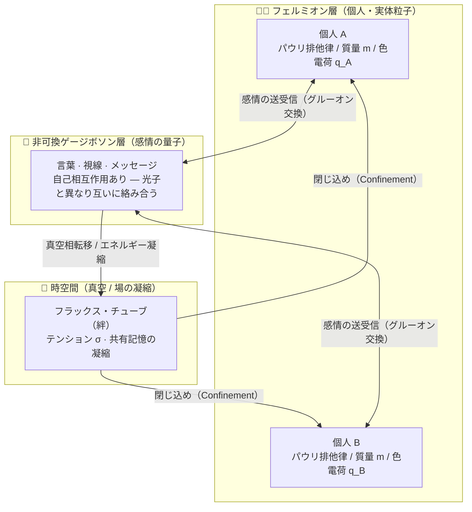
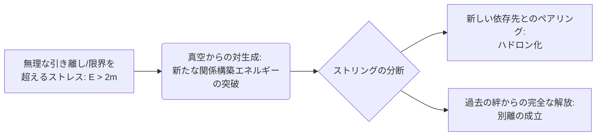

## はじめに

「どうしてあの人を、こんなに嫌っているのに忘れられないのか」
「どうして一緒にいるとケンカばかりなのに、離れると寂しくなるのか」

こうした**愛憎のパラドックス**は、詩人や哲学者がその言葉を尽くしてきたテーマだ。しかし、もしこれを物理学の「場（Field）」として書き下せたらどうだろう。

社会心理学者のクルト・レヴィンは1930〜40年代、人間の行動を「人と環境の関数」B = f(P, E) として記述する **場の理論（Field Theory）** を提唱した（参考：[Britannica, Kurt Lewin](https://www.britannica.com/biography/Kurt-Lewin)）。本稿ではさらに踏み込み、素粒子間の力を記述する **場の量子論（QFT: Quantum Field Theory）**、特にクォーク間に働く強い力を記述する **量子色力学（QCD: Quantum Chromodynamics）** のアナロジーを用い、人間関係の複雑な力学を数理的に定式化する。

> **📝 ミニ用語解説**
>
> - **場（フィールド）**：空間の各点に値を持つ「見えない雰囲気」のようなもの。風や磁力線を思い浮かべればOK。
> - **ゲージ理論**：対称性から「力」が自然に現れる理論。電磁気力も強い力も、この枠組みで記述できる。
> - **非可換**：「A×B ≠ B×A」になる性質。人間関係の「順序が大事」な現象と相性がいい。
> - **閉じ込め（Confinement）**：クォークが単独で取り出せない現象。人間関係でいうと「離れようとしても引き戻される力学」に相当する。

「近づきすぎると反発し、離れると引き戻される」「憎み合っているのに離れられない」といった愛憎のパラドックスは、物理学における非可換ゲージ場の振る舞いや、クォークの**閉じ込め（Confinement）** と驚くほどよく一致する。本稿ではこの矛盾を**有効場の理論（Effective Field Theory）** として統合し、人間関係の最適距離や別離のメカニズムを算出する具体的なモデルを提示する。物理に詳しくない読者向けに、各節の終わりには **日常語アナロジー** を添えた。

---

## 1. 前提と性質：愛の場の有効理論

人間というマクロな複雑系をミクロな量子力学で記述するため、本モデルは統計力学的な **有効場の理論** として定義される。つまり「低エネルギー領域で成り立つ、近似的でもそれなりに強力な記述」である。

_図1：本稿の理論構造の全体図。個人（フェルミオン）、感情（非可換ゲージボソン）、絆（真空フラックス・チューブ）の三層が相互に接続し、「閉じ込め」の力学を生み出している。_

### 1.1. 相互作用の主体（フェルミオンと個体の固有値）

> **ひとことメモ**：人は他者と"合体"できない、不変の実体粒子である。

人間（個人）は、関係性の場において不変の実体粒子である **フェルミオン** の有効自由度として扱われる。

#### パウリの排他原理と「個の境界」

フェルミオンは「全く同じ量子状態を共有できない」という絶対ルールを持つ。これは、**「どれほど深く愛し合っても、二人の人間が完全に同化して一つの実体になることは決してできない」** という人間の絶対的な孤独と境界を表す。

#### 愛の色電荷（Love Color Charge: $q$）

他者を惹きつける魅力や感情のベクトル。QCDにおける**カラー（色）電荷**のように、感情には多様な位相と極性があり、引力（愛）だけでなく、時に強烈な斥力（憎悪）を生み出す。

#### 質量と慣性 ($m$)

ここでの質量は **「新しい関係性を構築するためのエネルギー（心理的ハードル・出会いのコスト）」** として定義される。質量が大きい人ほど、新しい環境や他者との関係構築に多大なエネルギーを要する。

> **☕ 日常語アナロジー**
>
> - 「魂が溶け合った」と感じる夜でも、朝になれば別々の身体で起きる。これがパウリ排他律。
> - 「この人の第一印象、なんとなくピンと来た」はカラー電荷の位相マッチ。
> - 転職や引っ越しが億劫なのは、質量 $m$ が大きい状態。

### 1.2. 相互作用の媒介と動態（非可換ゲージボソン）

> **ひとこと**：愛も憎しみも、空中で絡み合う"力の使者"である。

愛や憎しみは、個人間を飛び交い力を伝達する **非可換ゲージボソン（グルーオンのアナロジー）** として定義される。

#### 媒介子（グルーオン）の交換

視線、言葉、メッセージ、LINEのスタンプ。気持ちを伝達するための **「コミュニケーションの量子」** である。

#### 自己相互作用と感情の絡み合い

電磁気力を媒介する光子とは異なり、非可換ゲージボソンは **「媒介子それ自体が電荷（感情）を持ち、互いに相互作用する」** という特異な性質を持つ。これは標準模型の中でもQCDを特別にしている性質で、光子が空中ですれ違っても素通りするのに対し、グルーオンは別のグルーオンと結びついて新しいグルーオンを生む。この**自己相互作用**が、後述する閉じ込めの根源となる（参考：[Wikipedia, Color Confinement](https://en.wikipedia.org/wiki/Color_confinement)）。

> **☕ 日常語アナロジー**
>
> - 放った愛の言葉が、相手の別の言葉と混ざって思わぬ怒りに変質する——これが自己相互作用。
> - メールのスレッドが炎上するのは、ボソン同士の結合が連鎖するから。
> - 光子（電磁気力）は素直だが、グルーオン（感情）は絡む。文学がQEDではなくQCDを必要とする所以である。

### 1.3. 時空間の性質（真空の凝縮とエントロピー）

> **ひとこと**：時間は関係に味を染み込ませ、放置は劣化を加速する。

#### 時間の蓄積（真空期待値の獲得）

関係性が長く続くほど、共有した記憶や時間が場（真空）に凝縮していく。これが **真空の相転移** を引き起こす。

#### エントロピーの増大

連絡を取り合う（エネルギーを注入する）ことを怠ると、熱力学第二法則に従い、関係性は無秩序へと向かい自然消滅する。

> **☕ 日常語アナロジー**
>
> - ぬか床と同じで、毎日かき混ぜないと関係も腐る。
> - 長く続いた関係ほど「真空期待値」が大きく、新しい出会いより濃密に感じる理由。

---

## 2. 基礎方程式と関係性の相転移

個人と愛の非可換ゲージボソンからなる系の全体像を、**ヤン・ミルズ理論** に基づくラグランジアン密度 $\mathcal{L}$ で記述する。

$$
\mathcal{L} = \bar{\psi}(i\gamma^\mu D_\mu - m)\psi - \frac{1}{4}G_{\mu\nu}^a G^{\mu\nu}_a
$$

> **📖 ラグランジアンの読み方（レシピとしての式）**
> 物理学におけるラグランジアンは、料理でいう「全レシピを1行に圧縮したメモ」である。必要な材料（場）と調理法（項）がすべて詰まっており、理論物理学者はここから「食べると何が起こるか（粒子の振る舞い）」を計算する。

この方程式は、人間関係のダイナミクスを決定づける2つの重要な項で構成されている。

### 第1項：個人の状態変化と感情の送受信

$$\bar{\psi}(i\gamma^\mu D_\mu - m)\psi$$

「あなた」と「他者」（フェルミオン $\psi, \bar{\psi}$）の存在状態と、その変化を表す。

- **質量 $m$（自己確立度）**：外部からの影響に対する抵抗力。この値が大きいほど、他者の言葉で容易には自分を変えない。
- **共変微分 $D_\mu$（コミュニケーションの相互作用）**：単なる時間経過ではなく、**「相手からどのような感情（ゲージ場）を受け取り、心を動かされたか」** という相互作用項を含んでいる。

### 第2項：感情そのものの振る舞いと絡み合い

$$-\frac{1}{4}G_{\mu\nu}^a G^{\mu\nu}_a$$

ヤン・ミルズ項。空間に放たれた感情のエネルギー状態を表す。**ボソン同士の自己相互作用** がこの項から現れ、放たれた愛や憎しみの言葉が空間で互いにぶつかり合い、増幅・変質・絡み合う。

### 2.1. SU(3)カラー対称性の拡張アナロジー

QCDのカラーは **赤・緑・青** の3種類で、ハドロン（陽子、中性子など）はこれらが合わさって **無色（color singlet）** になっている（参考：[PDG 2025 QCD Review, arXiv:2312.14015](https://arxiv.org/abs/2312.14015)）。

人間関係に引き直せば、「愛」は1次元のスカラー量ではなく、少なくとも以下の **3色の重ね合わせ** と考えるのが自然だろう。

| カラー      | 心理的成分 | 説明                                           |
| ----------- | ---------- | ---------------------------------------------- |
| 赤（Red）   | 情熱       | 近接作用が強く、短期的に発散しやすい           |
| 緑（Green） | 信頼       | フラックス・チューブを形成する線形項を強化する |
| 青（Blue）  | 尊敬       | 関係の対称性を守る、静的な背景                 |

> **☕ 日常語アナロジー**
> 健全な長期関係は「3色のバランスが取れた color singlet」、片思いは「赤だけが突出した色電荷を持つ不安定な状態」。「好きだけど尊敬できない」関係は、カラーが singlet 化していないので、閉じ込めが効かず遠くまで飛んでいってしまう。

_図2：愛の SU(3) カラー対称性ベン図。情熱（赤）・信頼（緑）・尊敬（青）の3色が調和した中央領域が「健全な長期関係」= Color Singlet。片思いは赤のみが突出した「カラー帯電」状態である。_

### 2.2. 真空の相転移とフラックス・チューブ（絆）の形成

- **初期フェーズ（摂動論的領域・クーロン力）**：恋愛の初期段階。ボソンは自由に飛び交い、距離が近いほど引力は強く、離れると急速に冷める。
- **成熟フェーズ（フラックス・チューブによる閉じ込め）**：共有した時間や記憶が場に凝縮し「真空の相転移」が起こると、自己相互作用によってボソン同士が強く絡み合い、二人の間を結ぶ一本のチューブ状のエネルギー（フラックス・チューブ）へと圧縮される。これが **「見えない絆の糸」** の物理学的正体である。距離が離れるほど強い力で二人を引き戻す（クォークの閉じ込め）。

---

## 3. 距離依存性の二面性：漸近的自由と閉じ込め

> **ひとことメモ**：近ければ近いほど自由で、離れれば離れるほど束縛される——それがQCDの最も奇妙で美しい性質。

現行の記事では「近づくと引力、離れると束縛」と簡略化したが、QCDの本当の凄みは、**距離によって力の強さそのものが変わる** ことにある。

### 3.1. 走る結合定数（Running Coupling）

QCDの結合定数 $\alpha_s$ はエネルギースケール $Q^2$ の関数として変化する（参考：[Wikipedia, Asymptotic Freedom](https://en.wikipedia.org/wiki/Asymptotic_freedom)）。

$$
\alpha_s(Q^2) \approx \frac{1}{\beta_0 \ln(Q^2/\Lambda_{QCD}^2)}, \quad \beta_0 = \frac{1}{4\pi}\left(11 - \frac{2}{3}n_f\right)
$$

$\beta_0 > 0$（クォークのフレーバー数が16以下なら成立）であることから、$Q^2$ が大きい（=距離が短い）ほど $\alpha_s$ は小さくなる。これが **漸近的自由性（Asymptotic Freedom）** である。

_図3：走る結合定数 αs(Q²) の模式図。横軸はエネルギースケール Q（＝1/距離 r）、縦軸は相互作用の強さ。左（低Q・遠距離）では α_s が大きく束縛が強まり（閉じ込め）、右（高Q・近距離）では α_s が減少し自由になる（漸近的自由性）。Gross・Politzer・Wilczek による1973年の発見で、2004年ノーベル物理学賞受賞。_

### 3.2. 2004年ノーベル物理学賞のストーリー

この現象は1973年、当時まだ大学院生だったデヴィッド・ポリッツァーと、フランク・ウィルチェック（指導教官はデヴィッド・グロス）によって、独立に発見された。彼らはこの功績により **2004年ノーベル物理学賞** を受賞した（参考：[The Nobel Prize in Physics 2004](https://www.nobelprize.org/prizes/physics/2004/summary/), [CERN Courier, Asymptotic Freedom Wins Nobel](https://cerncourier.com/a/asymptotic-freedom-wins-nobel/)）。

当時の物理学界の常識は「粒子間の力は近づけば強くなる」というものだった。しかしQCDでは逆に、**近づけば近づくほど力は弱くなり、自由に振る舞える**。遠ざかると反対に束縛が強まり、絶対に引き離せなくなる。ゴムひもとよく似た振る舞いだ。

### 3.3. 人間関係への翻訳

この二面性は、人間関係のいくつかの不可解な現象を説明する。

| 物理スケール           | 人間関係               | 現象                                       |
| ---------------------- | ---------------------- | ------------------------------------------ |
| 高エネルギー（近距離） | 日々同居・常に会う関係 | 意外と冷静に振る舞える。ケンカしても即解決 |
| 低エネルギー（遠距離） | 長期間会えない関係     | 執着が強まり、些細な連絡途絶が大事件化     |

> **☕ 日常語アナロジー：遠距離恋愛パラドックス**
> 「距離は恋心を冷ます」と「距離は恋心を募らせる」はどちらも真であり、矛盾しない。**近距離では漸近的自由**、**遠距離では閉じ込め** という相反する2相が、同じ関係の中で共存している。
>
> **SNS時代の"浅い大量接続"**：数百のフォロワーと気軽に繋がれるSNSは、全体として **漸近的自由（deconfined）領域** に留まっている。フラックス・チューブが形成されないから関係は軽く、冷めやすい。「いいね」の応酬はグルーオン交換の摂動論的レジームである。

---

## 4. 定式化：愛と憎の「有効ポテンシャル」

このフラックス・チューブの形成を踏まえ、量子色力学の **コーネル・ポテンシャル** を有効モデルとして導入する。

### 4.1. 愛のポテンシャル（引力と絆）

$$
V_{love}(r) = -\frac{\alpha}{r} + \sigma r
$$

- **第1項 $-\alpha/r$（近接作用 / 情熱）**：距離が近いほど急激に働く引力。$\alpha$ は愛情表現の豊かさ。
- **第2項 $\sigma r$（フラックス・チューブ / 絆の張力）**：距離 $r$ が離れるほど、元の状態に引き戻そうとするゴムひものような力。$\sigma$ は共有した記憶によって形成されたチューブの強靭さ（ストリング・テンション）。

### 4.2. 憎のポテンシャル（斥力と呪縛）

感情の色電荷が反転し、近接時の力が斥力へと変わった状態である。

$$
V_{hate}(r) = +\frac{\alpha}{r} + \sigma r
$$

- **第1項 $+\alpha/r$（至近距離での拒絶）**：距離が近づくほどエネルギーが発散し、強烈に反発する。
- **第2項 $+\sigma r$（遠距離での呪縛）**：過去に強い絆 $\sigma$ が形成されている場合、物理的に離れて縁を切ろうとしても、フラックス・チューブが心を相手に引き戻し続ける。

> **☕ 日常語アナロジー**
> 愛のポテンシャルは **「近すぎるとくっつきすぎてぎこちなく、離れすぎると寂しい」** というゴムひもの張力。憎のポテンシャルは **「近づきたくないけど、かといって完全に切れない」** という呪われたゴムひも。どちらも"ひも"の本質は同じで、符号が違うだけだ。

_図4：愛（左）と憎（右）の有効ポテンシャル。橙・緑の破線は構成要素（−α/r クーロン項、σr 線形項）。左グラフは距離が離れるにつれポテンシャルが無限に上昇し（閉じ込め）、右グラフは r₀ に最小値を持ち「嫌いだが縁を切れない相手」との最適距離を示す。_

---

## 5. 絆の正体：双対超伝導体モデルと嫉妬の磁束線

> **ひとことメモ**：絆の物理的正体は、真空中に凝縮した「嫉妬の磁気モノポール」が作る磁束線である。

ここまで「フラックス・チューブがなぜ形成されるのか」という機構を詳述してこなかった。これを説明する最も有力な候補が、**南部陽一郎・'t Hooft・Mandelstamによる双対超伝導体モデル（Dual Superconductor Model）** である（参考：[CERN Courier, A Watershed: The Emergence of QCD](https://cerncourier.com/a/a-watershed-the-emergence-of-qcd/)）。

### 5.1. マイスナー効果の双対としての閉じ込め

通常の超伝導体では、**電気的**なクーパー対（電子ペア）が凝縮することで、外部から侵入する磁場が細い糸状に押し込められる（マイスナー効果の裏返し）。これが Type-II 超伝導体中の磁束量子（フラクソン）である。

QCD真空はこれの **双対（dual）** であると考えられている。つまり、**磁気モノポール** が凝縮することで、**電気（カラー電気）的** なフラックスが細い糸状に閉じ込められる。この糸こそがフラックス・チューブの正体であり、クォークを引き離せない根本原因だ。

_図5：双対超伝導体モデルの概念図。磁気モノポール（紫点 = 嫉妬・独占欲の凝縮）がフラックス・チューブの外側を取り囲み、カラー電場を糸状に閉じ込める。チューブ内を流れる矢印は力の伝達方向。外側の波線はカラー電場が外部に漏れないことを示す（マイスナー効果の双対）。_

### 5.2. 人間関係アナロジー：嫉妬こそが絆の実体

この機構を人間関係に翻訳すると、ある種のパラドックスが浮かび上がる。

- **磁気モノポール ＝ 嫉妬・独占欲・排他性**
- **モノポール凝縮 ＝ 関係の閉鎖性（他者を排除する約束）**
- **フラックス・チューブ（絆） ＝ その結果として実体化する関係性**

つまり、**絆という言葉は抽象的な美しさではなく、「他者を排除する凝縮エネルギー」が作り出している具象的な磁束線** である。

> **☕ 日常語アナロジー**
> 「嫉妬深い関係」が悪いという現代的通念に対し、物理学は意外な回答を示す。**一切の嫉妬・独占性を排除した「完全にオープン」な関係では、フラックス・チューブが形成されない**。結果として「絆」と呼べる強い結合は生まれにくい。
>
> 結婚制度、指輪、誕生日の独占予約——これらは社会的に制度化された「磁気モノポールの凝縮場」である。ロマンチックさと物理的実体は、ここで奇跡的に一致する。

### 5.3. 注意：これはアナロジーであって処方箋ではない

念のため断っておくと、これは「嫉妬深くあれ」という処方箋では**全くない**。単に「なぜ強い絆は強い制約と表裏一体なのか」という現象論的な説明である。第8章で改めて触れる。

---

## 6. 自己変容：カイラル対称性の自発的破れ

> **ひとことメモ**：あなたの「自分らしさ」の9割は、関係性の中から動的に生成されている。

### 6.1. カイラル対称性の破れとクォーク凝縮

QCDラグランジアンは、クォーク質量を無視すれば **カイラル対称性**（左巻きクォークと右巻きクォークの独立な変換対称性）を持つ。しかし実際のQCD真空では、この対称性が **自発的に破れている**。その徴候が **クォーク凝縮** である。

$$
\langle \bar{q}q \rangle \neq 0
$$

これは「真空そのものが、クォーク・反クォーク対で満ちている」ことを意味する（参考：[CERN Courier, Symmetry Breaking on a Supercomputer](https://cerncourier.com/a/symmetry-breaking-on-a-supercomputer/)）。

### 6.2. "Mass Without Mass"：質量の9割は結合から生まれる

驚くべき事実として、陽子の質量の **約99%** は、中のクォークの素の質量ではなく、**グルーオンとの相互作用エネルギー** から生まれている。これをウィルチェックは **"Mass Without Mass"**（質量なき質量の生成）と呼んだ（参考：[Wilczek Nobel Lecture](https://www.nobelprize.org/prizes/physics/2004/wilczek/lecture/)）。

つまり、私たちが日常で扱う物質の重さのほぼすべては、**粒子単体ではなく、粒子間の相互作用から立ち現れている**。

### 6.3. 人間関係への翻訳：アイデンティティの動的生成

この構造は、人間関係における **自己形成** の力学と驚くほど一致する。

- **孤立した個人**：ほぼゼロ質量のカイラルな状態。方向性のない左右対称な自由度。
- **関係を結ぶ個人**：周囲との「凝縮」が起きることで対称性が破れ、**自分らしさ**（動的質量）が結晶化する。

> **☕ 日常語アナロジー**
> 「自分探しの旅」が往々にして空振りに終わる理由は、自己のかなりの部分が **他者との相互作用の副産物** だからだ。一人で山に籠もっても、クォーク凝縮は起きない。家族、恋人、友人、同僚、敵——これらとの非可換な絡み合いの中で、あなたの質量は動的に獲得される。
>
> パウリ排他律（個の絶対性）と、カイラル凝縮（関係からの自己生成）は矛盾しない。**個は合体できないが、関係なしには質量を持てない**。この緊張こそが、人間であることの本質的な構造である。

---

## 7. 具体的なモデルとユースケース

数式から導かれる現象を、実際の人間関係の悩みに適用する。

### 7.1. ユースケース1：嫌いな相手との「最適ソーシャルディスタンス」

憎のポテンシャル $V_{hate}(r)$ は下に凸の関数となり、微分して傾きがゼロになる極小値（安定する底）が存在する。

$$
\frac{dV_{hate}}{dr} = -\frac{\alpha}{r^2} + \sigma = 0 \quad \Rightarrow \quad r_0 = \sqrt{\frac{\alpha}{\sigma}}
$$

この $r_0$ は、職場の上司や親族など **「嫌いだが縁を切れない相手」** に対する最もエネルギーを消費しない物理的・心理的な最適距離である。無理に近づけば反発力（$\alpha$）で衝突し、無理に退職や絶縁で離れようとすれば呪縛の力（$\sigma$）で多大なストレスを消費する。この $r_0$ の距離を戦略的に保つことが **「冷戦の最適解」** となる。

### 7.2. ユースケース2：ストリングの分断（String Breaking）と「別離・浮気」

憎み合い、反発し合っている二人を無限に閉じ込めることは物理的に可能なのだろうか？

物理学（QCD）において、二つの粒子を無理やり引き離し、フラックス・チューブに蓄えられたエネルギー（$\sigma r$）が閾値（$E_{break} \approx 2m$）を超えると、真空から新たな粒子・反粒子のペアが生成され、チューブはプツンと分断される（ハドロン化）。

なお、この現象は長らく理論予想に留まっていたが、**2024〜2025年にQuEra・ハーバード大らによって、中性原子を用いたプログラマブル量子シミュレータ上で初めて直接観測された**（参考：[Nature 642, 315–320 (2025), "Observation of string breaking on a (2+1)D Rydberg quantum simulator"](https://www.nature.com/articles/s41586-025-09051-6)）。理論上のアナロジーだった"絆の切断"が、実験室で可視化された瞬間である。

_図6：ストリング分断（別離・浮気）のフロー図。フラックス・チューブに蓄積されたエネルギーが閾値 E > 2m を超えると、真空から新たなペアが生成され、既存の絆は分断される。D（新しい依存先へのハドロン化）と E（完全な別離の成立）の2経路は、それぞれ「浮気」と「純粋な別れ」に対応する。_

これは人間関係における **「別れの成立」や「浮気への逃避」の物理モデル** である。$m$ は「新しい関係性を具現化するために必要なエネルギー（心理的ハードル・出会いのコスト）」である。耐え難い憎しみや距離の限界によって関係を引き裂こうとするエネルギー（$\sigma r$）が、新しい出会いを生み出す労力（$2m$）を上回った極限の瞬間、人間は無意識のうちに場（外部）から「新しい出会い」「没頭できる趣味」「弁護士などの第三者」といった新たな粒子を生成し、そこと新しいペアを作る。その結果、過去の強力なフラックス・チューブは断ち切られる。

### 7.3. ユースケース3：遠距離恋愛の臨界点

愛のポテンシャル $V_{love}(r) = -\alpha/r + \sigma r$ で、$r$ が大きくなると $\sigma r$ が単調増加する。つまり **距離は累積コストを生む**。

ある臨界距離 $r_c$（$\sigma r_c \approx 2m$）を超えた瞬間、ストリング・ブレイキングの条件が満たされ、遠距離恋愛は破綻しやすくなる。

- $\sigma$（絆の強さ）が大きいカップルほど $r_c$ は**小さく**なる（逆説的：強い絆ほど遠距離に弱い）
- $m$（新しい関係構築コスト）が大きい人ほど $r_c$ は**大きく**、耐えやすい

> **☕ 日常語アナロジー**
> 「強い絆で結ばれたほど遠距離に弱く、関係構築が苦手な人ほど遠距離を耐え抜く」という、直感に反する結論が導かれる。これは各地の実際の破綻データとも概ね一致する現象論である。

### 7.4. ユースケース4：SNS時代の"漸近的に自由な"関係網

フォロワー数百・数千という現代的な関係網は、ほぼすべて **漸近的自由領域（deconfined phase）** に留まる。$\alpha_s$ が小さいので、個々の結合は弱く、フラックス・チューブは形成されない。

- 利点：エントロピー的に維持コストが低い。ゆるやかに広く繋がれる。
- 欠点：どの関係もフラックス・チューブが形成されないため、深い「絆」にはならない。

真の閉じ込め相（confining phase）に入るには、意図的に $\alpha_s$ を大きくする——つまり**個別の関係に集中的な時間とエネルギーを注入する**——必要がある。

### 7.5. ユースケース5：熱愛→倦怠→憎悪の相転移シナリオ

長期関係における典型的な心理的変遷を、相転移として再解釈できる。

| 時期   | 物理対応           | 特徴                                               |
| ------ | ------------------ | -------------------------------------------------- |
| 熱愛期 | 摂動論的クーロン相 | $-\alpha/r$ が支配、距離ゼロの引力                 |
| 安定期 | 閉じ込め相         | フラックス・チューブが形成され、$\sigma r$ が効く  |
| 倦怠期 | 真空凝縮の定常状態 | カイラル凝縮が完了し、対称性が破れ切った状態       |
| 憎悪期 | 色電荷の反転       | $-\alpha/r \to +\alpha/r$ の符号反転（熱愛の鏡像） |
| 別離   | ストリング分断     | $\sigma r > 2m$ による対生成                       |

```mermaid
flowchart LR
    classDef passion  fill:#FEF2F2,stroke:#EF4444,stroke-width:2px,color:#1E293B
    classDef stable   fill:#F0F9FF,stroke:#3B82F6,stroke-width:2px,color:#1E293B
    classDef fatigue  fill:#F8FAFC,stroke:#94A3B8,stroke-width:2px,color:#475569
    classDef hate     fill:#4C1D95,stroke:#7C3AED,stroke-width:2px,color:#FFFFFF
    classDef breaking fill:#022C22,stroke:#10B981,stroke-width:2px,color:#D1FAE5

    A["熱愛期\n摂動論的クーロン相\n−α/r が支配"]:::passion
    B["安定期\n閉じ込め相\nフラックス・チューブ形成"]:::stable
    C["倦怠期\nカイラル凝縮の定常状態\n対称性が破れ切った状態"]:::fatigue
    D["憎悪期\n色電荷の反転\n+α/r が支配"]:::hate
    E["別離\nストリング分断\n対生成 σr > 2m"]:::breaking

    A -->|"真空の相転移"| B
    B -->|"カイラル凝縮完了"| C
    C -->|"色電荷の符号反転"| D
    D -->|"σr > 2m を突破"| E
```

_図7：長期関係における相転移シナリオ。熱愛期（クーロン相）に始まり、真空の相転移を経て閉じ込め相（安定期）へ移行、カイラル凝縮完了後に倦怠期の定常状態となる。色電荷の符号反転で憎悪期に突入し、蓄積エネルギーが 2m を超えた瞬間にストリング分断（別離）が成立する。各矢印は相転移を引き起こすトリガーを示す。_

---

## 8. 理論の限界と警句

> **ひとことメモ**：このモデルは**記述する**が**処方しない**。

ここまで物理と心理学のアナロジーを楽しんできたが、最後に**重要な注意書き**を置く。

### 8.1. アナロジーは証明ではない

本稿のモデルは、QCDという厳密な理論の**有効場の理論的な類推**であり、数学的な**証明**ではない。人間関係が本当にSU(3)非可換ゲージ場に従うわけではなく、あくまで「そう見るとある種の現象が整理できる」というメンタルモデルである。

### 8.2. UV完了されていない

物理の有効場の理論は、高エネルギー（=短距離）では破綻し、より基本的な理論（UV completion）に置き換わる。本稿のモデルも同様で、**個人の意識・無意識・社会構造・歴史的文脈**といった、より深い層の前では無力である。恋愛相談を物理学者に頼ってはいけない理由である。

### 8.3. モデルは処方しない

特に第5章の「嫉妬＝磁気モノポール凝縮＝絆の実体」という結論は、**誤読されると危険**である。「絆を強くするために嫉妬を強化すべき」という処方箋では断じてない。これはあくまで「強い閉じ込めと強い制約が表裏一体である」という現象論的記述にすぎない。

### 8.4. パウリ排他律は最後まで守られる

どれだけ関係性が凝縮し、カイラル対称性が破れ、フラックス・チューブが形成されても、**二人の人間が量子状態として同化することは決してない**。これは物理学的にも、倫理的にも、絶対のルールである。個の尊厳は、ラグランジアンの冒頭の $\bar{\psi}\psi$ 項に最初から刻まれている。

---

## おわりに

「愛の反対は無関心である」というエリ・ヴィーゼルの言葉は、本理論において **「無関心とは非可換ゲージボソンの交換が一切ない真空状態である」** として翻訳される。真空は"空っぽ"ではなく、単に**励起がない**だけで、カラー対称性もカイラル構造もそのまま眠っている。愛と憎は同じ場の異なる励起であり、その反対にあるのは両者の**不在**——無関心である。

なぜ人は憎み合っても別れられないのか（閉じ込め）。なぜ距離によって感情の性質まで変わるのか（漸近的自由）。なぜアイデンティティは関係から動的に生まれるのか（カイラル凝縮）。なぜ絆には必然的に制約が伴うのか（双対超伝導体）。そして、なぜ最終的に別の依存先を見つけて別れることができるのか（ストリング分断）。

これらを **「自発的対称性の破れ」や「ハドロン化」** といった物理学の力学系として統合するパラドックス的アプローチは、複雑な人間関係の力学を **俯瞰** するための強力なメンタルモデルとなる。ただし繰り返すが、これは **有効理論** であり、**UV完了** ではない。日常の恋愛に適用するときは、物理学者よりもむしろ詩人や臨床心理士の言葉を優先していただきたい。

---

## 用語集

| 用語                         | 一言説明                                                       |
| ---------------------------- | -------------------------------------------------------------- |
| **場（Field）**              | 空間の各点に値を持つ物理量。本稿では愛や憎の位相として扱う     |
| **フェルミオン**             | パウリ排他律に従う粒子。本稿では「個人」                       |
| **ゲージボソン**             | 力を媒介する粒子。光子・グルーオンなど。本稿では「感情の量子」 |
| **非可換（Non-Abelian）**    | 交換則が成り立たない。グルーオン同士が相互作用する             |
| **フラックス・チューブ**     | クォーク間に形成される糸状のエネルギー。本稿では「絆」         |
| **閉じ込め（Confinement）**  | 単独のクォークが取り出せない現象。本稿では「離れられない力学」 |
| **漸近的自由性**             | 近距離で結合が弱くなる性質。2004年ノーベル物理学賞             |
| **コーネル・ポテンシャル**   | $V(r) = -\alpha/r + \sigma r$ の形の有効ポテンシャル           |
| **ストリング・ブレイキング** | フラックス・チューブが対生成で切れる現象                       |
| **カイラル対称性の破れ**     | 真空が左右対称を自発的に失う現象。質量生成の起源               |
| **双対超伝導体モデル**       | 磁気モノポール凝縮による閉じ込め機構の候補理論                 |
| **有効場の理論（EFT）**      | 特定のエネルギー領域で成り立つ、近似的だが強力な理論           |

---

## 参考・推薦リンク

### 基礎文献

- **PDG 2025, Quantum Chromodynamics Review** (J. Huston, K. Rabbertz, G. Zanderighi): [arXiv:2312.14015](https://arxiv.org/abs/2312.14015) — 閉じ込めとポテンシャルの数理的根拠
- **Stanford Encyclopedia of Philosophy, Quantum Field Theory**: [plato.stanford.edu/entries/quantum-field-theory/](https://plato.stanford.edu/entries/quantum-field-theory/) — 相互作用とラグランジアンの基礎構造

### 漸近的自由性（第3章）

- **The Nobel Prize in Physics 2004** (Gross, Politzer, Wilczek): [nobelprize.org/prizes/physics/2004/summary/](https://www.nobelprize.org/prizes/physics/2004/summary/)
- **Wilczek Nobel Lecture: "Asymptotic Freedom: From Paradox to Paradigm"**: [nobelprize.org/prizes/physics/2004/wilczek/lecture/](https://www.nobelprize.org/prizes/physics/2004/wilczek/lecture/)
- **CERN Courier, "Asymptotic Freedom Wins Nobel"**: [cerncourier.com/a/asymptotic-freedom-wins-nobel/](https://cerncourier.com/a/asymptotic-freedom-wins-nobel/)

### 閉じ込めとストリング分断（第5・7章）

- **Wikipedia, Color Confinement**: [en.wikipedia.org/wiki/Color_confinement](https://en.wikipedia.org/wiki/Color_confinement)
- **CERN Courier, "Mapping Quark Confinement by Exotic Particles"**: [cerncourier.com/a/mapping-quark-confinement-by-exotic-particles/](https://cerncourier.com/a/mapping-quark-confinement-by-exotic-particles/)
- **Nature 642, 315–320 (2025), "Observation of String Breaking on a (2+1)D Rydberg Quantum Simulator"**: [nature.com/articles/s41586-025-09051-6](https://www.nature.com/articles/s41586-025-09051-6) — 量子シミュレータによるストリング分断の初観測

### カイラル対称性の破れ（第6章）

- **CERN Courier, "Symmetry Breaking on a Supercomputer"**: [cerncourier.com/a/symmetry-breaking-on-a-supercomputer/](https://cerncourier.com/a/symmetry-breaking-on-a-supercomputer/) — 南部–ジョナ=ラシニオ機構の格子QCD検証

### QCDの歴史・概論

- **CERN Courier, "A Watershed: The Emergence of QCD"** (Wilczek著): [cerncourier.com/a/a-watershed-the-emergence-of-qcd/](https://cerncourier.com/a/a-watershed-the-emergence-of-qcd/)
- **Wikipedia, Asymptotic Freedom**: [en.wikipedia.org/wiki/Asymptotic_freedom](https://en.wikipedia.org/wiki/Asymptotic_freedom)

### 社会心理学的背景

- **Britannica, Kurt Lewin**: [britannica.com/biography/Kurt-Lewin](https://www.britannica.com/biography/Kurt-Lewin) — 本稿のアイデアの先駆としての場の理論

---

> _本稿は量子色力学の厳密な定式化を応用した**メンタルモデル**であり、文学的・哲学的示唆を目的としている。恋愛・人間関係の実務的アドバイスは、物理学ではなく専門家にご相談を。_
