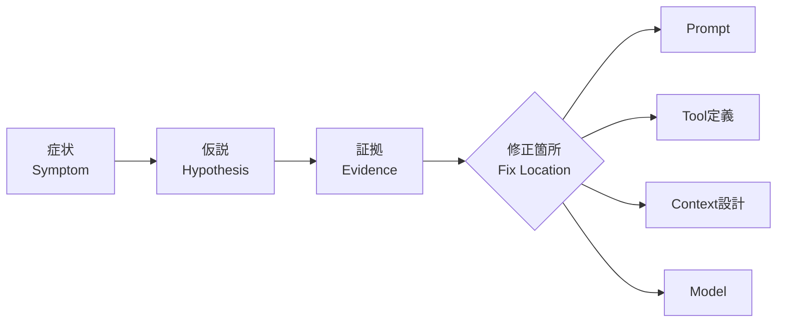
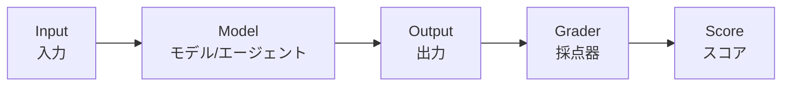
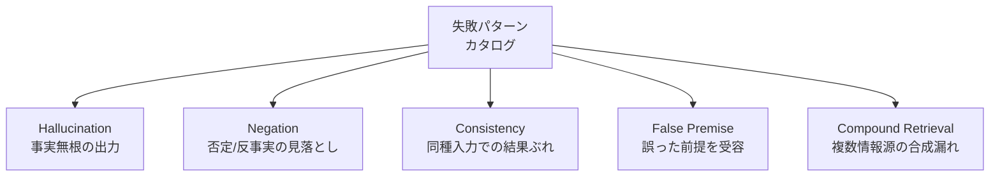

## はじめに

2026年5月、サンフランシスコで開催された Anthropic Partner Bootcamp に参加してきました。Anthropicが自社のパートナー向けに行うエンジニア向けトレーニングで、2日間にわたりエージェント工学のディシプリンを実機ハンズオンで叩き込まれます。

参加して最も印象に残ったのは、各セッションで繰り返し語られたある一つの"テーゼ""でした。

> LLMシステムの失敗の大半は、モデルの問題ではなく、プロンプト・エージェント構成・ツール設計の問題である。

LLM機能をアプリケーションに乗せた経験のあるエンジニアなら、一度はこう思ったことがあるはずです。「精度が出ない。Sonnetからの差し替え先はOpusでよいか？」と。ところが、上位モデルに差し替えても症状が変わらないケースが少なくない。出力のフォーマットがぶれる、ツール呼び出しの引数を取り違える、長い入力で前半を忘れる、といった現象は、**モデルの能力ではなく設計の問題**であることが大半です。Bootcampで何度も刷り込まれたのは、まさにこの原則でした。

本記事は、トレーニングの題材詳細には立ち入らず、**そこで得た技術的気付きを「自分のチームの設計レビューでチェックリストとして使える粒度」にまで抽象化した6つの原則**として紹介します。

### 想定読者

LLM 機能を備えたアプリケーションのリリース経験はあるが、エージェント構築の原則を体系的に学んでいない中堅以上のエンジニアです。

## 原則1: モデル更新は最後の手段

精度問題に直面したとき、ほとんどのエンジニアの第一手は「モデルを上げる」です。これは古典的なソフトウェア工学の「ハードウェアを増強する」と同じ反応で、大抵の場合、筋の悪い手段です。

LLM エージェントの不具合は、おおむね次の4層のどこかで発生します。



「Modelを差し替える」は最後の手段です。なぜなら、

- Prompt層: 指示の曖昧さ・否定形・矛盾は、上位モデルでもしばしば同じ症状を出す
- Tool層: 引数スキーマや description が曖昧だと、モデルを上げても呼び出しがぶれる
- Context層: 長い履歴に埋もれた前提は、コンテキストウィンドウを広げても精度に直結しない

経験則として、最初に着手すべきは **「症状を再現する最小入力」を作って、層を一つずつ排除する**ことです。上位モデルへの差し替えは、他の3層を潰してから検証する。逆にすると、「Opusで直った」のか「プロンプトを書き直したついでに直った」のかが区別できなくなります。

Bootcampで何度か体験した「動かなかったエージェントを直す」演習でも、Haiku/Sonnetの利用という制約が課されましたが、実際にすべてプロンプトとツール定義の修正で症状が消えていきました。これは演習だから、ではなく、**現場のエージェント不具合の構造**を反映していると感じています。

Anthropic 自身も "[Building effective agents](https://www.anthropic.com/engineering/building-effective-agents)" の中で、**最も単純な仕組みから始めて必要に応じて足していく**ことを強調しています。モデル差し替えはその「足す」の最後の選択肢です。

## 原則2: コンテキストは容量ではなく資源

「コンテキストウィンドウが1M トークンに伸びた」というニュースを聞くと、つい「全部入れておけば賢く判断してくれるだろう」と感じます。これは罠です。

Chroma の公開研究 "[Context Rot](https://research.trychroma.com/context-rot)" は、**入力が長くなるほどモデルの忠実性・検索性能・推論精度が劣化する**ことを実証しました。1M トークン入る、とは「物理的に入る上限」であって、「精度が出る上限」ではありません。

つまりコンテキストウィンドウは**容量ではなく資源**として扱う必要があります。ターン設計時に、各情報について次の判断を明示的に下す:

| 判断     | 適用条件                         | 手段                           |
| -------- | -------------------------------- | ------------------------------ |
| 残す     | 直近のタスクに直結する           | そのまま履歴に置く             |
| 捨てる   | 過去ターンでしか参照されない     | 履歴から落とす                 |
| 要約する | 流れの理解には必要だが原文は冗長 | LLMで圧縮し原文を差し替え      |
| 外に逃す | 後で再取得可能な大容量データ     | DBやベクタストアに退避、ID参照 |

Anthropic の "[Effective context engineering for AI agents](https://www.anthropic.com/engineering/effective-context-engineering-for-ai-agents)" でも、コンテキスト窓を「使い切る」のではなく「設計する」対象として扱うべきだと述べられています。

実装の手触りとして重要なのは、**コンテキスト設計は実行時の意思決定**だということです。プロンプトテンプレートを1回書いて終わりではなく、ターンごとに「今、何を残すか」を判定するロジックが必要になります。

## 原則3: 3層責務モデル

エージェントの挙動を制御する箇所は、ざっくり3層に分けられます。

| 層                            | 何を書く                               | 主な責務                     |
| ----------------------------- | -------------------------------------- | ---------------------------- |
| **System Prompt**       | 役割・原則・非交渉条件                 | エージェントの「動機付け」   |
| **Tool Description**    | ツールの目的・引数の意味・使用条件     | ツール呼び出しの「文脈付け」 |
| **Tool Implementation** | 実行時の入力検証・エラー文言・自己修復 | 実行の「安全網」             |

この3層構造そのものは、エージェントをある程度構築したことのある人なら頭では理解できていると思います。ところがBootcampで実機を触りながら何度も指摘されたのは、**「同じ責務を複数層に重ねて防御しようとする」アンチパターン**に陥っていることでした。

たとえば「日付フォーマットは ISO 8601 で」というルールを system prompt にもツール description にも実装側の検証にも書く。これは一見堅牢に見えますが、

- 矛盾が出たとき、どの層を信じるかが不明になる
- 仕様変更時、どこを直したらよいかが分散する
- モデルの判断が「どの記述を優先するか」に揺れる

という副作用を生みます。

| 失敗パターン               | 直す層                                                      |
| -------------------------- | ----------------------------------------------------------- |
| 役割そのものを誤解している | System Prompt                                               |
| 正しいツールを選べていない | Tool Description                                            |
| 引数の値域を取り違える     | Tool Description（enumで縛る）+ Tool Implementation（検証） |
| エラー時に黙る/暴走する    | Tool Implementation（明示的なエラー返却）                   |

ツール description は **「モデルが読むドキュメント」** という意識で書くと精度が安定します。日付パラメータなら「形式: `YYYY-MM-DD`。営業日のみ。例: `2026-05-25`」のように、形式・制約・例を1セットで添える。

たとえば天気エージェントの場合、ツール定義は次のような粒度になります。

```python
{
    "name": "get_forecast",
    "description": (
        "指定地点の天気予報を取得する。"
        "観測値ではなく予報であることに注意。"
        "過去日付を渡すと InvalidDateError を返す。"
    ),
    "input_schema": {
        "type": "object",
        "properties": {
            "location": {
                "type": "string",
                "description": "IATA空港コード(3文字)または都市名(英語)。例: HND, Tokyo",
            },
            "date": {
                "type": "string",
                "description": "予報対象日。形式: YYYY-MM-DD。今日から7日先まで。",
            },
        },
        "required": ["location", "date"],
    },
}
```

「description が長すぎる」と感じるかもしれません。しかし**ツールの description は、人間のドキュメントを書くつもりで書く**のが正解です。短く曖昧な description はモデルに推測を強い、推測はぶれを生みます。

## 原則4: Eval先行 ― Eval is the spec

「動いた」と「測れる」は別の状態です。エージェントの品質を語るには、評価スイートが先に存在している必要があります。実装してから評価を書くと、評価は **「望ましい挙動の定義」ではなく「現在の挙動の正当化」** に流れがちです。

評価スイートは、概念的に5要素に分解できます。



ここで重要なのは Grader の選び方です。Grader は次の3種類があり、**コストと信頼性のバランスから Code を優先する**のが定石です。

| Grader種別             | 適用領域                                   | コスト | 信頼性               | 実務での割合目安 |
| ---------------------- | ------------------------------------------ | ------ | -------------------- | ---------------- |
| **Code**         | フォーマット、必須フィールド、値域、ID一致 | 低     | 高                   | 80%              |
| **LLM-as-Judge** | 文章の妥当性、要約の網羅性、トーン         | 中     | 中（プロンプト次第） | 15%              |
| **Human**        | 最終ゲート、グレーゾーンの校正             | 高     | 高                   | 5%               |

Code で書けるものを Code で書く、というのは当たり前のようでいて、実務では「とりあえず LLM-as-Judge で全件採点」に流れがちです。これはコストが線形に増え、しかも Judge 自体が不安定（flaky）になりやすい。**「Code で書けないことだけを Judge に上げる」** を徹底すると、評価が CI に乗ります。

PRD やユーザストーリーに書かれた「こうあってほしい」は、すべて assertion に翻訳できるはずです。翻訳できないものは、要件としても曖昧だというサインです。

## 原則5: 平均ではなく分布で語る

LLM の出力は `temperature=0` でも完全には決定的ではありません。GPU の浮動小数点演算、バックエンドの実装差、トークナイザの揺らぎなどに由来する非決定性があります。

このため、**同じ入力に対して n 回実行し、結果の分布を見る**のが正しい計測方法です。

```python
results = [run_eval(case) for _ in range(num_runs)]
scores = [r.score for r in results]
print(f"min={min(scores)}, max={max(scores)}, mean={sum(scores)/len(scores)}")
```

ここで pass@k と pass^k を分けて理解しておく必要があります。

| 指標             | 定義                                 | 使いどころ                                 |
| ---------------- | ------------------------------------ | ------------------------------------------ |
| **pass@k** | k回試行のうち1回でも成功すれば pass  | 探索的タスク、リトライ前提のフロー         |
| **pass^k** | k回試行のすべてで成功して初めて pass | 本番運用、ユーザリトライを期待しないフロー |

平均が90%でも、pass^3 が40%なら、ユーザ体験としては「3割の確率で壊れる」フィーチャです。SLA を語るときは **平均ではなく p99** で語る、これがLLM プロダクトの規律です。

## 原則6: 見えていない入力で汎化を測る

最後の原則は、「エージェント品質は何で決まるか」という根本の問いに関わります。

従来型ソフトウェアでは「開発時に書いたテストが通れば出荷可能」というメンタルモデルが通用しました。しかしエージェントでは、**開発時に存在しなかった入力にどれだけ耐えられるか**こそが品質の本体です。なぜなら、

- 開発セットで95%が出ていても、入力分布が変わると性能が崩れる
- プロンプトのチューニングは、見えている入力に過剰適合しやすい
- 本番のユーザ入力は、開発時の想定の外側を常に攻めてくる

対策は2つあります。

1. **開発セットと評価セットを物理的に分離する**: 評価セットは設計者が見ない。最終評価時にだけ通す
2. **失敗パターンを先にカタログ化する**: 実装前に「どんな入力で壊れうるか」を列挙し、各カテゴリでテストを書く

失敗パターンのカタログは、汎用的なソフトウェアテストの類型として整理できます。



これらは「ネガティブテスト」「増分テスト」と呼ばれる、ソフトウェア工学では古典的なテストカテゴリです。LLM 文脈でも、これらを **実装前に列挙して各カテゴリで1〜数件のテストを書いておく**ことで、評価セットが「開発時の想定の外側」を含む状態を作れます。

汎化を測る最終的な指標は、「**開発時に1度も見せていない入力での挙動**」です。ここで崩れるなら、まだ出せない。ここを通れば、ハンドオフできる証拠になります。

Bootcampの最終セッションでは、参加者が時間内に組み上げたエージェントを「事前に存在を知らされていなかった入力」に通す形で評価されました。**開発セットで満点が出ていても、未知の入力では崩れる**――この体験は理屈で分かっているつもりだったことを、肌で再認識させてくれるものでした。

## 結び — 設計レビュー用チェックリスト

6つの原則を、自分のチームの設計レビューにそのまま使える質問に翻訳します。

- [X] **原則1**: 「精度が出ない」を「モデルを上げる」で解決しようとしていないか？層別に切り分けたか？
- [X] **原則2**: コンテキストに何を残し、何を捨て、何を要約し、何を外に逃すかをターン単位で設計しているか？
- [X] **原則3**: 同じ責務を System Prompt / Tool Description / Tool Impl の3層に重複させていないか？
- [X] **原則4**: 評価スイートは実装より先に書いたか？Code で書けるものを Judge に流していないか？
- [X] **原則5**: 評価結果を平均で語っていないか？pass^k で見ているか？
- [X] **原則6**: 開発時に1度も見ていない入力での評価結果を持っているか？失敗パターンは事前にカタログ化したか？

これらは、モデルが Opus になろうと Mythos になろうと、おそらく変わらない設計の規律です。モデルは進化しますが、**設計の質は人間が担う領域**として残り続けます。

### 所感

Bootcampに参加する前、私はLLMアプリケーションの品質を「モデルが追いつくのを待つ仕事」だと半分くらい思っていました。実際には逆で、**モデルの能力に頼りきらない設計**を積み上げることでしか品質は出ない、というのが2日間で繰り返し示されたメッセージでした。本記事の6原則は、その学びを抽象化したものです。明日からの設計レビューで一つでも意識していただけたなら、この記事を書いた甲斐があり幸いです。


*会場は Ferry Building 近くの [SHACK15](https://shack15.com/)*


*窓越しに Bay Bridge を望む。San Francisco 随一のロケーション*


*Ferry Building 内のマーケットプレイス。Blue Bottle Coffeeや Dandelion も入っている*


*Anthropic スタッフ・AJ参加者との集合写真*
